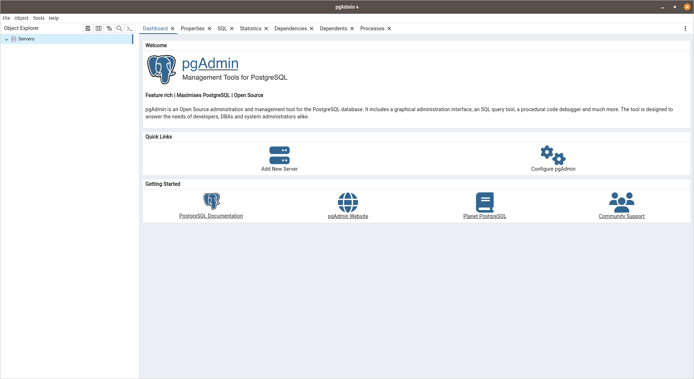
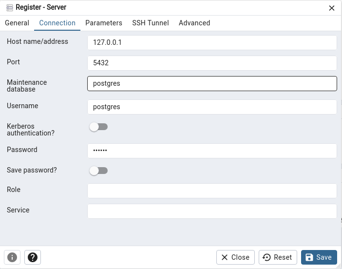
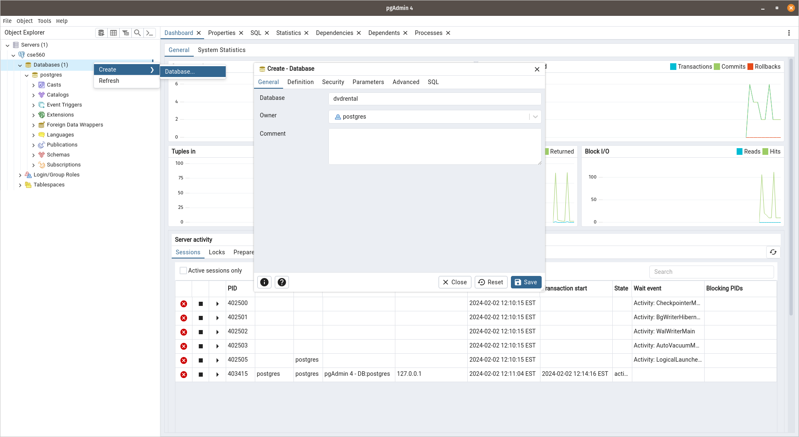
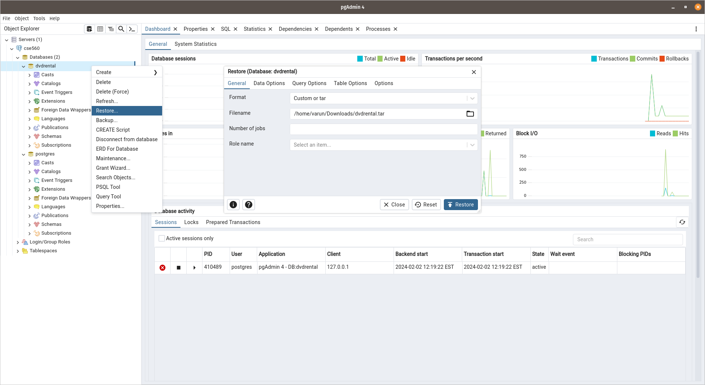
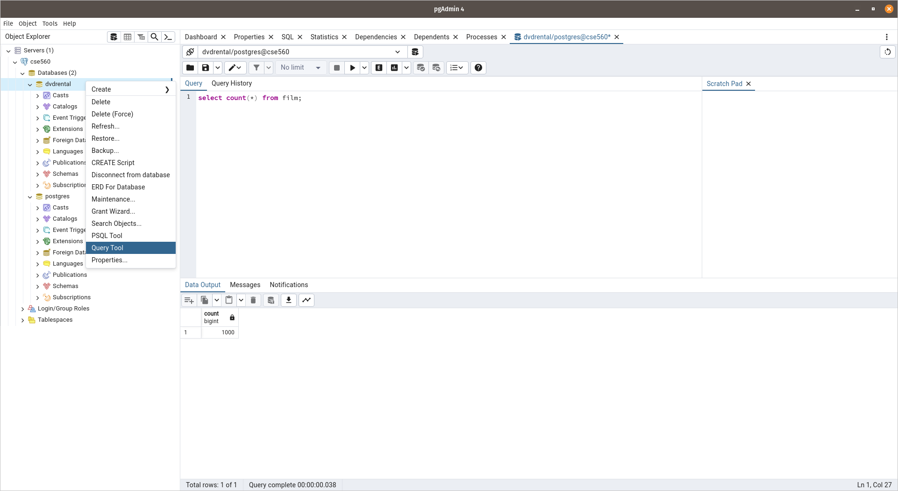

# `postgresql` Ubuntu/Debian setup

- [`postgresql` Ubuntu/Debian setup](#postgresql-ubuntudebian-setup)
  - [Installing Postgres](#installing-postgres)
    - [Testing postgres](#testing-postgres)
  - [Installing `pgadmin`](#installing-pgadmin)
    - [Using `pgadmin`](#using-pgadmin)
      - [Download the sample database](#download-the-sample-database)
      - [Restore the sample database from the `.tar` file](#restore-the-sample-database-from-the-tar-file)
      - [Test whether the restore was successful](#test-whether-the-restore-was-successful)

## Installing Postgres

```bash
sudo apt update && apt install bash-completion curl wget gpg lsb-release postgresql postgresql-contrib -y

sudo service postgresql start

sudo -u postgres psql
```

### Testing postgres

```bash
sudo -u postgres psql
```

You should see a sql query prompt. In the sql query prompt, run

```sql
ALTER USER postgres PASSWORD 'new_password';
```

## Installing `pgadmin`

```bash
cd ~/Downloads

curl -fsS https://www.pgadmin.org/static/packages_pgadmin_org.pub | sudo gpg --dearmor -o /usr/share/keyrings/packages-pgadmin-org.gpg

sudo sh -c 'echo "deb [signed-by=/usr/share/keyrings/packages-pgadmin-org.gpg]  https://ftp.postgresql.org/pub/pgadmin/pgadmin4/apt/$(lsb_release -cs) pgadmin4 main" > /etc/apt/sources.list.d/pgadmin4.list && apt update'

sudo apt install pgadmin4 -y
```

### Using `pgadmin`

Simply search for it in your app launcher and hit return. You should now see a window like this:



Once you see the window, right click on the `Servers` option in the sidebar to create a new server called `CSE560`. Set the connection hostname/address to the localhost address with the default port `5432` and the password you set earlier like so:



In the sidebar right click on databases and create a new database called `dvdrental`



#### Download the sample database

```bash
curl -O https://www.postgresqltutorial.com/wp-content/uploads/2019/05/dvdrental.zip

unzip dvdrental.tar
```

#### Restore the sample database from the `.tar` file

In `pgadmin` right click on the `dvdrental` database and click restore. Navigate to the `dvdrental.tar` file.



#### Test whether the restore was successful

Right click on the `dvdrental` database and select the query tool. There, run:

```sql
select count(*) from film;
```



You should see the output shown in the image above.
